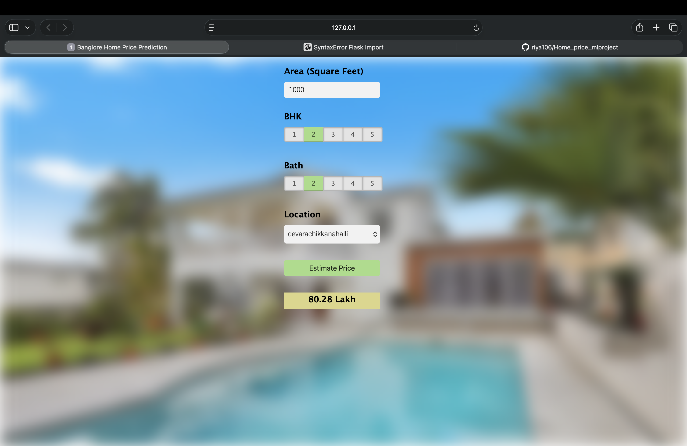

#  Bangalore Home Price Prediction

A full-stack Machine Learning web application that predicts house prices in Bangalore based on user inputs like location, square footage, BHK, and bathrooms.

This project integrates:

- Machine Learning model (Scikit-learn)
- Flask backend API
- HTML/CSS/JavaScript frontend
- AJAX communication
- JSON data handling

---

##  Features

- Predict house price instantly
- Dynamic location dropdown (fetched from backend)
- REST API using Flask
- Clean and interactive UI
- Modular backend structure

---

## 🛠 Tech Stack

### Backend
- Python
- Flask
- NumPy
- Scikit-learn
- Pickle

### Frontend
- HTML
- CSS
- JavaScript
- jQuery

---

##  Project Structure

bang.project/
│
├── server/
│ ├── server.py
│ ├── util.py
│ ├── artifacts/
│ │ ├── columns.json
│ │ └── banglore_home_prices_model.pickle
│
├── model/
├── client/
└── README.md

